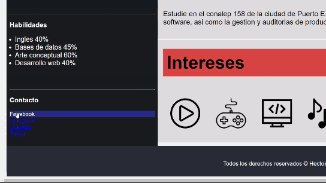

# Práctica 01. Portafolio
## Instrucciones
### Para poder ejecutar este portafolio basta con entrar en la carpeta html de este repositorio y ejecutar el archivo "index.html".
## Lenguajes de marcado
 ### Para poder realizar esta practica implemente HTML junto a CSS en el editor de Visual Studio code, junto con algunos iconos e imagenes para poder darle un poco mas de estilo a este portafolio

# Parte del codigo  HTML

# Parte del codigo  CSS

# Captura de pantallas en diferentes navegadores para poder comprobar la compatibilidad con estos mismos

## Efectos en el area de Contacto

## Google Chrome

### Con vista alejada para que se logre apreciar todo el diseño (zoom -50 %)

### Con  vista normal (zoom normal (100%))

## Opera

### Con vista alejada para que se logre apreciar todo el diseño (zoom -50 %)

### Con  vista normal (zoom normal (100%))

## Brave Software (nativo)

### Con vista alejada para que se logre apreciar todo el diseño (zoom -50 %)

### Con  vista normal (zoom normal (100%))

## Edge
### Con vista alejada para que se logre apreciar todo el diseño (zoom -50 %)

### Con  vista normal (zoom normal (100%))

